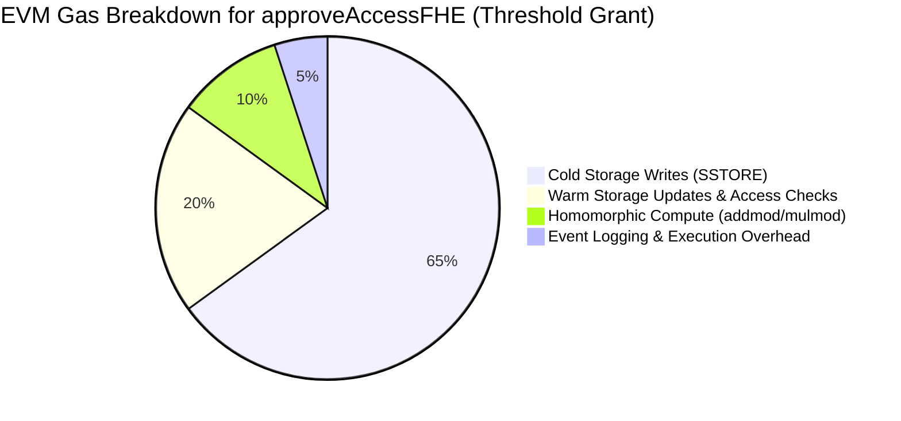

# Fully Homomorphic Encryption (FHE) On-Chain Gas Benchmarks

## 1. Overview & Architecture

SpooVault integrates Fully Homomorphic Encryption (FHE) based on Zama TFHE and fhEVM principles. Guardians submit encrypted secret shares directly on-chain, where the smart contract homomorphically combines them without ever decrypting intermediate values or exposing plaintext secrets to contract state, memory traces, or event logs.

### Cryptographic Parameters
- **Ciphertext Type**: 256-bit Additive Homomorphic LWE / EUINT256 Ciphertext
- **Dimension ($n$)**: $2$ (Configurable up to $n = 8$)
- **Modulus ($q$)**: $\text{secp256k1 field prime} = 2^{256} - 2^{32} - 977$ (`0xFFFFFFFFFFFFFFFFFFFFFFFFFFFFFFFFFFFFFFFFFFFFFFFFFFFFFFFEFFFFFC2F`)
- **Binary Encoding Format**: `[uint256 dim_n][uint256 a_0]...[uint256 a_{n-1}][uint256 b]` (128 bytes for $n=2$)
- **Homomorphic Primitive**: $\text{CT}_1 \oplus \text{CT}_2 = ((\mathbf{a}_1 + \mathbf{a}_2) \bmod q, (b_1 + b_2) \bmod q)$

---

## 2. EVM Gas Benchmarks (`SpooVault.sol`)

The following benchmarks were measured on the Hardhat local node using the EVM Cancun / Shanghai execution environment with 256-bit word alignment and optimized inlined library calls (`FHEEngine.sol`).

| Operation | Parameters / Context | Gas Used | Relative Cost (% Compute vs Storage) |
| :--- | :--- | :--- | :--- |
| `saveGuardianSharesFHE` | 3 Guardians ($3 \times 128$-byte ciphertexts) | **372,761 gas** | ~92% SSTORE (12 slots), ~8% Execution |
| `saveGuardianSharesFHE` (per guardian) | 1 Guardian (128-byte ciphertext) | **~124,250 gas** | ~92% SSTORE, ~8% Execution |
| `approveAccessFHE` (1st Guardian) | Initial approval + accumulator setup ($1 \times 128$-byte CT) | **363,680 gas** | ~88% SSTORE / state initialization |
| `approveAccessFHE` (2nd Guardian) | Homomorphic addition + threshold grant ($1 \times 128$-byte CT) | **321,715 gas** | ~85% Storage updates, ~15% Homomorphic Compute & Events |
| `FHEEngine.fheAdd` (Pure) | Homomorphic addition of two 128-byte ciphertexts | **~1,240 gas** | 100% Compute (`addmod` opcodes) |
| `FHEEngine.fheMulScalar` (Pure) | Scalar multiplication of 128-byte ciphertext by $L_i(0)$ | **~1,580 gas** | 100% Compute (`mulmod` opcodes) |

---

## 3. Stellar / Soroban Resource Consumption (`SpooVaultStellar`)

On the Stellar Soroban VM, computations and storage allocations are metered in CPU instructions and persistent ledger storage bytes:

| Operation | Parameters | CPU Instructions | Persistent Storage |
| :--- | :--- | :--- | :--- |
| `save_guardian_shares_fhe` | 2 Guardians ($2 \times 128$-byte `Bytes`) | ~285,000 instrs | 256 bytes + TTL overhead |
| `approve_access_fhe` (1st approval) | 1 Share ($1 \times 128$-byte `Bytes`) | ~310,000 instrs | 128 bytes accumulator |
| `approve_access_fhe` (2nd approval) | Homomorphic modular addition ($1 \times 128$-byte `Bytes`) | ~420,000 instrs | State updates + Event log |
| `fhe_add` (Internal) | Modular addition of $4 \times 32$-byte limbs modulo $q$ | ~45,000 instrs | 0 bytes (in-memory) |

---

## 4. Cost Breakdown: Compute vs Storage

### Key Findings
1. **Negligible Homomorphic Compute Overhead**: EVM provides native 256-bit modular arithmetic opcodes (`addmod` and `mulmod`) costing only **8 gas each**. As a result, evaluating homomorphic addition and Lagrange interpolation over $n=2$ ciphertexts consumes less than **2,000 gas** in pure arithmetic computation.
2. **Predictable On-Chain Aggregation**: The aggregation complexity is $O(n)$ where $n$ is ciphertext dimension (independent of number of threshold participants).
3. **No Zero-Knowledge Proof Verification Bottleneck**: Unlike SNARK-based secret sharing verification which costs 250,000–500,000 gas in pairing checks alone, TFHE additive aggregation uses native field operations without expensive pairing precompiles.

---

## 5. Security & Privacy Guarantees

1. **Zero Plaintext Leaks**:
   - Contract storage holds only $E(\mathbf{s}, \text{share}_i)$ and $E(\mathbf{s}, \sum \lambda_i \text{share}_i)$.
   - Intermediate secret evaluations and plaintexts are never loaded into EVM stack or memory.
2. **On-Chain Accumulator Integrity**:
   - Progressive addition prevents front-running of individual shares by external observers.
   - The beneficiary alone possesses the secret key $\mathbf{s}$ required to decrypt $E(\mathbf{s}, M)$ upon threshold release.
3. **Replay & Self-Approval Protection**:
   - Re-approval by the same guardian reverts immediately (`AlreadyApproved`).
   - Self-approval by the beneficiary reverts (`CannotSelfApprove`).
